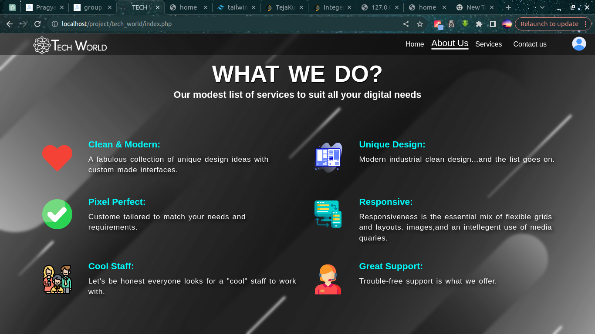
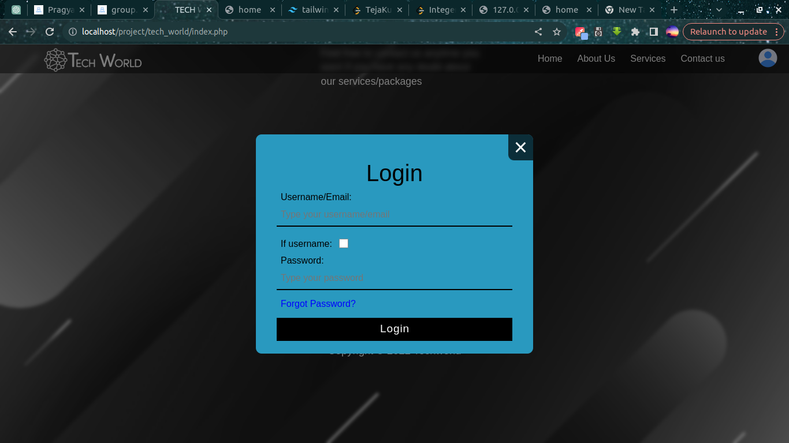
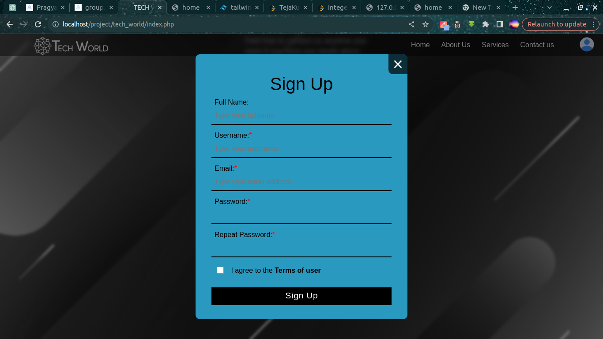
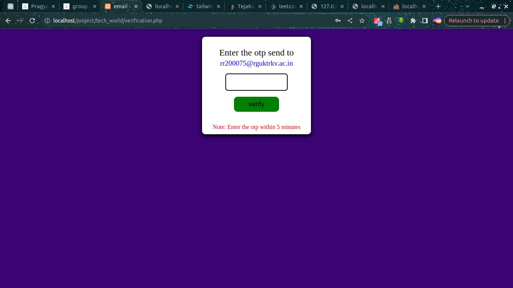
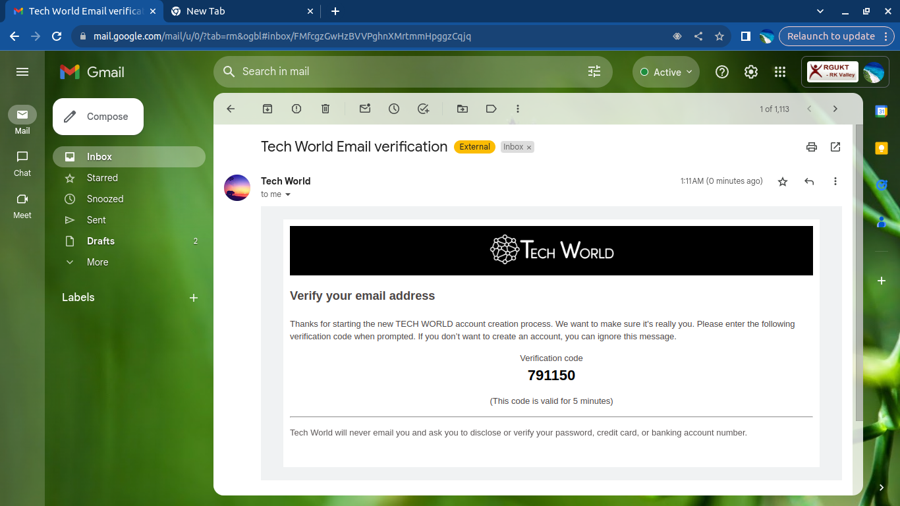

# Tech World
<h2>Technologies used: </h2>
<h3>Frontend: </h3>
<ul>
	<li>HTML</li>
	<li>CSS</li>
	<li>JavaScript</li>
</ul>
<h3>Backend: </h3>
<ul>
	<li>PHP</li>
	<li>MySQL database</li>
	<li>XAMPP server</li>
	<li>PHP Mailer to send email for otp verification</li>
</ul>
<h2>Description: </h2>

This is a company website where user can visit and get to know about the company

<h2>Home page: </h2>

<h2>AboutUs page: </h2>

<h2>Service page: </h2>

<h2>ContactUs page: </h2>

<h2>SignIn page: </h2>

<h2>SignUp page: </h2>

<h2>Email verification page: </h2>

<h3>Sent Mail UI: </h3>

<h2>Notification alert UI: </h2>

